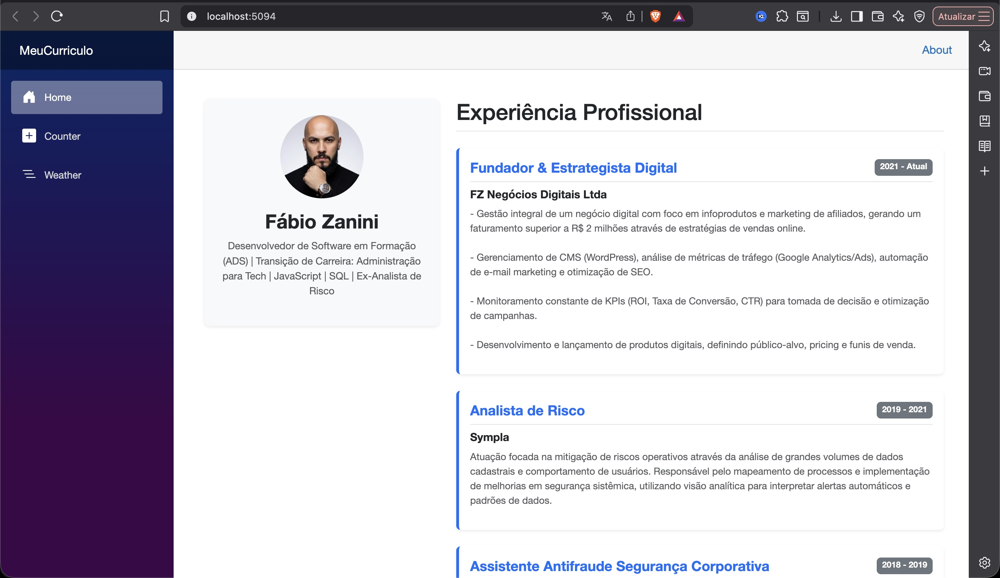

# 📄 Currículo Interativo & Portfólio Profissional - Blazor

## 👤 Identificação
- **Nome Completo:** Fábio Henrique Zanini Ferreira [cite: 57]
- **Curso:** Análise e Desenvolvimento de Sistemas (ADS) - Centro Universitário UNA [cite: 57]
- **Instituição:** UNA Belo Horizonte

---

## 🚀 Guia de Execução
Para rodar este projeto localmente no seu computador via terminal, siga os passos abaixo[cite: 60]:

1. **Certifique-se de ter o .NET SDK instalado** (Versão 8.0 ou superior).
2. **Abra o terminal** na pasta raiz do projeto (`MeuCurriculo`).
3. **Execute o comando:**
   ```bash
   dotnet run
4. **Acesse no navegador:** O terminal indicará uma URL (geralmente http://localhost:5000 ou similar).

---

## 🛠️ Tecnologia Utilizada
- **Framework:** Blazor (ASP.NET Core)
- **Linguagem:** C# (C-Sharp) .NET
- **Estilização:** Bootstrap 5
- **Runtime:** .NET 8.0 / 9.0

---

## 📸 Screenshot da Aplicação


---

## 🧠 Heurística de Nielsen: Ajuda e Documentação
**Definição:** Embora o sistema deva ser fácil de usar sem documentação, ela deve ser fácil de buscar e focada na tarefa do usuário.

**Aplicação neste projeto:**
Neste currículo interativo, a heurística de **Ajuda e Documentação** foi aplicada através de uma interface minimalista e autoexplicativa:
1. **Foco na Tarefa:** O layout separa claramente o perfil (esquerda) da trajetória profissional (direita), permitindo que o recrutador encontre a informação desejada sem manuais complexos.
2. **Clareza de Informação:** O uso de badges coloridos para datas e títulos em negrito ajuda na leitura rápida (escaneabilidade), servindo como uma documentação visual imediata sobre o nível de experiência e tempo de cada cargo.

---

## ⚙️ Explicação Técnica: [Parameter]
O atributo `[Parameter]` foi essencial para tornar o componente `ExperienciaCard.razor` reutilizável. Ele permite que a página `Home.razor` envie dados específicos (Empresa, Cargo, Descrição) para cada instância do componente, evitando a repetição de código HTML para cada experiência profissional listada.

---

## 📦 Diferenciais Técnicos
- **Componentização:** Uso de um componente reutilizável para exibição de dados dinâmicos.
- **Raw String Literals:** Utilização de aspas triplas (`\"\"\"`) no C# para manter a formatação original e quebras de linha de textos longos.
- **Estilização Dinâmica:** Implementação de `white-space: pre-line` via CSS para garantir que o navegador respeite as quebras de linha da base de dados.
"""